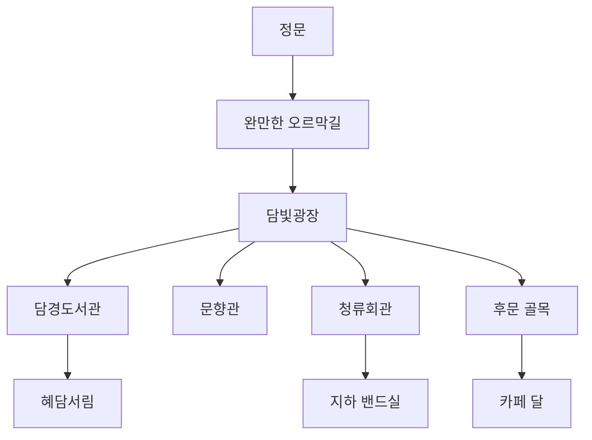

# Campus Map Blueprint

## 1. Canon Campus

- public name: 혜담대학교 인문캠퍼스
- city mood: 종로-혜화권의 오래된 서울
- map principle: 작지만 층위가 있고, 걷는 시간이 감정이 되도록 설계

## 2. Macro Layout

## 3. Space Roles

### 정문

- 외부 세계에서 캠퍼스로 진입하는 경계
- 우연한 마주침, 등교/하교, 계절 첫 인상에 사용

### 완만한 오르막길

- 둘이 나란히 걷는 장면의 기본 축
- 가까워질 때는 속도가 맞고, 멀어질 때는 보폭이 어긋난다

### 담빛광장

- 군중과 소음이 가장 많이 섞이는 장소
- 낮엔 활기, 밤엔 잔향
- 공개적인 감정 사건에 적합

### 담경도서관

- 차분한 집중과 미세한 감정 떨림의 공간
- 창가 좌석이 핵심 포인트
- 장면 톤: 얇은 햇빛, 낮은 소음, 종이 냄새

### 혜담서림

- 첫 예외가 발생하는 서점
- 창가와 책장 사이 시야가 중요
- 장면 톤: 투명한 빛, 부드러운 그림자, 조용한 호기심

### 문향관

- 국문과 및 문예 동아리 축
- 포스터, 게시판, 정원 벤치로 학생 생활감 확보
- 장면 톤: 붉은 벽돌, 나무 그늘, 바람에 흔들리는 종이

### 청류회관 지하 밴드실

- 아린의 발신성이 가장 선명해지는 공간
- 감정 폭발과 음악적 에너지의 실내 거점
- 장면 톤: 방음재, 케이블, 앰프 열기, 저녁의 체온

### 후문 골목

- 캠퍼스에서 사적인 공간으로 넘어가는 중간 지대
- 고백 전후, 이별 전후, 말이 늦게 나오는 장면에 적합

## 4. Internal Map Priority

가장 먼저 평면을 잡을 공간:

1. 담경도서관 3층 창가 구역
2. 혜담서림 창가 코너
3. 청류회관 지하 밴드실
4. 카페 달 내부

## 5. Visual Rule

- 전체 캠퍼스는 `너무 웅장`보다 `생활과 잔향`이 우선이다
- 건물 하나하나보다 연결 동선이 더 중요하다
- 지도는 길찾기용보다 감정 배치용이다

## 6. Episode Deployment Rule

- 초반부: 정문, 오르막길, 서점, 도서관 비중 높음
- 중반부: 광장, 밴드실, 후문 골목 비중 상승
- 후반부: 캠퍼스 내부보다 카페 달, 한강, 빈 복도처럼 여백 많은 장소 비중 상승
